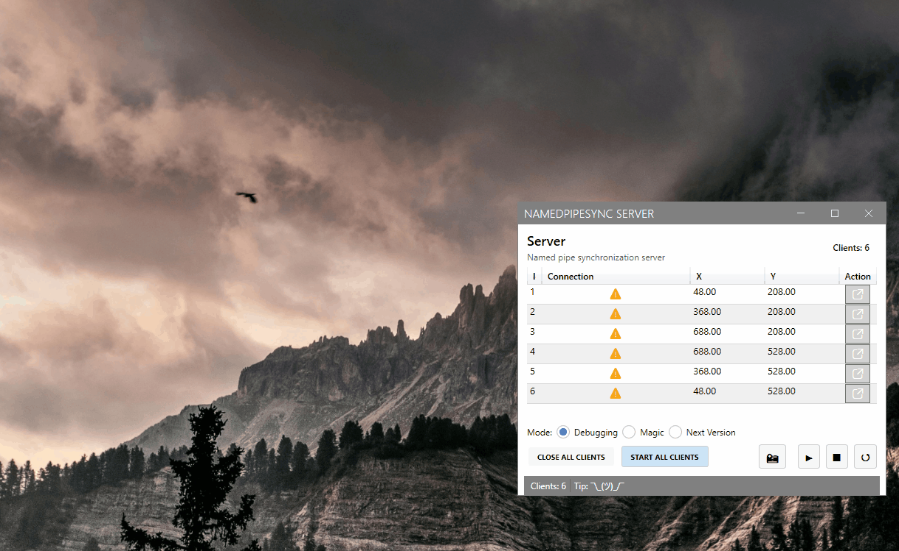

# Named Pipe Sync — IPC Overview and Usage

> Note: This is a personal pet project intended to demonstrate the possibility of a simple IPC layer using Windows Named Pipes. 

> It is not a production-ready library.

> Stack: WPF, .NET 9, MahApps.Metro, DevExpress MVVM, Jetbrains Junie.



## 📘 Goals

> Note: code is heavily agent-assisted using [JetBrains Junie](https://www.jetbrains.com/junie/).

- 🔍 Try to use Windows Named Pipes for IPC client discovery.
- ⏱️ Check the server-to-client communication, latency, and visual smoothness (tests use up to six moving client windows).
- 🎨 Experiment with [MahApps.Metro](https://mahapps.com/) WPF components.
- 📐 Apply lightweight domain-driven ideas where they add clarity.
- ⚙️ Check some ideas for .editorconfig (don't like those already).

## 🤖 Agent goals

Rider with Junie (GPT-5) is used.

🤖 Use agent-assisted development

- Agents generate code while I supervise and refine the [guidelines.md](.junie/guidelines.md) and the overall workflow.
- Phone: I do some adjustments to spec and guides while sitting on the train from the office.
- Copy to the computer when I get home, then implement the changes.
- Should code as little as possible, max 30 min a day.

📘 Self-contained interface documentation

- See [guidelines.md](.junie/guidelines.md).

The idea is that self-contained interface documentation is good for AI.

> Workflow: write interface with initial docs, run agent to create implementation, recreate docs (trim manually), regenerate code.

- Work with interfaces or DTOs when possible, as they are usually smaller and more focused.
- This helps the assistant understand relationships without needing all implementation details.
- Will not load full implementations to context, keep is small and prevent hallucinations.

## Overview

This repository contains a lightweight inter‑process communication (IPC) layer built on Windows Named Pipes. It enables
a single server process to communicate with up to six client processes (identified by integer `clientId`).

Clients automatically discover and connect to the server, and the server tracks each client’s connection state and can send
coordinate updates to a specific client by its `clientId`.

Key parts live in the `NamedPipeSync.Common` library under `Pipes`:

- Protocol types and serialization: `PipeProtocol`, `MessageType`, `PipeMessage` and DTOs (`ClientHelloMessage`,
  `CoordinateMessage`, `ByeMessage`).
- Server implementation and interface: `INamedPipeServer`, implemented by `NamedPipeServer`.
- Client implementation and interface: `INamedPipeClient`, implemented by `NamedPipeClient`.

Discovery pipe name (well-known):

- `NamedPipeSync_Discovery` (see `PipeProtocol.DiscoveryPipeName`).

## Communication Protocol (Mermaid)

The following sequence diagram shows how clients discover the server, establish a session, and receive coordinates.
Messages are JSON, one per line, with the `type` field set to `hello`, `coordinate`, or `bye`.

## Interfaces and Intended Usage

- INamedPipeServer
  - Start(): Begin accepting connections on the discovery pipe.
  - StopAsync(): Stop accepting new clients and dispose of all connections.
  - ConnectedClientIds: Snapshot of currently connected clientIds.
  - IsClientConnected(clientId): Check if a client is connected.
  - SendCoordinateAsync(clientId, x, y): Send a coordinate pair to a specific client.
  - Events: ClientConnected(int clientId), ClientDisconnected(int clientId).

- INamedPipeClient
  - ConnectAsync(retryDelay?): Auto-discover the server by repeatedly trying to connect to the discovery pipe; sends
    Hello with its `clientId`.
  - Observables:
    - `Connected: IObservable<Unit>` — emits when connection is established.
    - `Disconnected: IObservable<Unit>` — emits when the connection is lost or closed.
    - `Coordinates: IObservable<Coordinate>` — emits received coordinates for this client.
  - SendByeAsync(): Optionally notify the server before disconnecting.
  - DisconnectAsync()/Dispose(): Clean up resources.

## Minimal Example

Server:

```csharp
var server = new .Common.Pipes.NamedPipeServer();
server.ClientConnected += id => Console.WriteLine($"Client {id} connected");
server.ClientDisconnected += id => Console.WriteLine($"Client {id} disconnected");
server.Start();

// Send to a specific client when ready
await server.SendCoordinateAsync(3, 10.5, 20.25);
```

Client (one per process, with unique clientId 0..5 or 1..6):

```csharp
var client = new NamedPipeSync.Common.Pipes.NamedPipeClient(clientId);
client.Connected += () => Console.WriteLine("Connected");
client.Disconnected += () => Console.WriteLine("Disconnected");
client.CoordinateReceived += (x, y) => Console.WriteLine($"Coords: {x}, {y}");
await client.ConnectAsync();
```

## Notes and Constraints

- Operating system: Windows (uses `System.IO.Pipes`).
- Transport: JSON messages (one per line) over message-mode named pipes.
- Identification: Each client must use a unique integer `clientId` known to both client and server.
- Scalability: Designed around up to six clients but supports replacement if a client reconnects with the same id.
- Threading: The server handles clients concurrently; callbacks (events) fire on thread-pool threads.
- Error handling: Malformed messages are ignored; disconnects are detected via read errors or `Bye` message.
