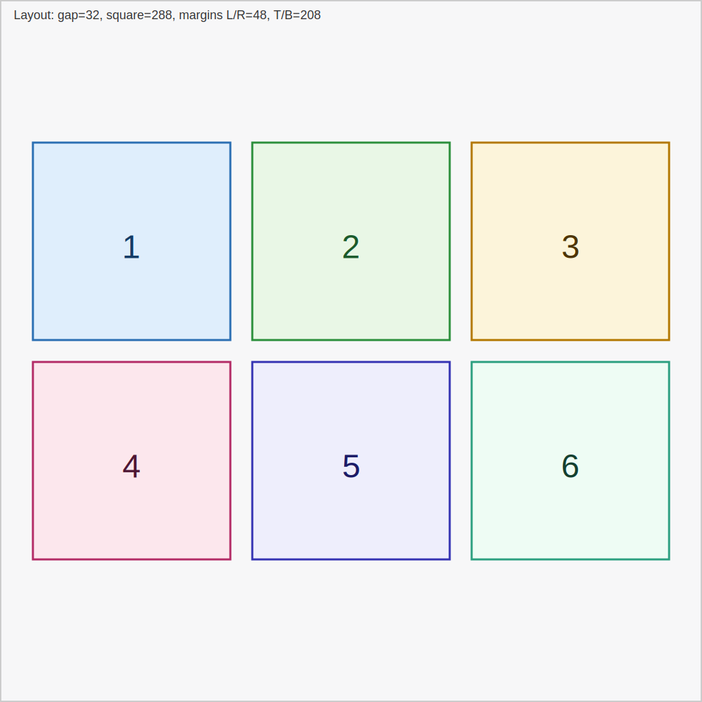
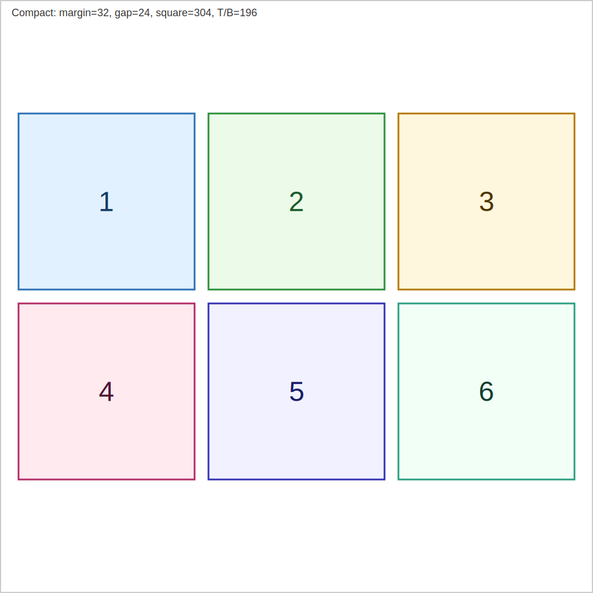

# Image layout: 6 non-overlapping square sub-images for 1024×1024 image

This document gives a simple, safe layout for placing 6 square sub-images inside a 1024×1024 canvas so they:

- Do not overlap
- Are not too close to each other
- Are centered with even outer margins

Below are three illustrated cases (each SVG is 1024×1024 and shows the canvas and the 6 squares with their top-left
coordinates and sizes).

Case A — Recommended layout (gap = 32)

- Canvas size: 1024 × 1024 px
- Gap: 32 px
- Square size: 288 × 288 px
- Left/right margin: 48 px
- Top/bottom margin: 208 px
- Coordinates (x, y top-left):
    - Row 0: (48,208), (368,208), (688,208)
    - Row 1: (48,528), (368,528), (688,528)

Case B — Smaller gap variant (gap = 24, keep left/right margin = 48)

- Canvas size: 1024 × 1024 px
- Gap: 24 px
- Square size: 293 × 293 px (floor((1024 - 2*48 - 2*24)/3) = 293)
- Top/bottom margins (centered): 207 px
- Coordinates (x, y top-left):
    - Row 0: (48,207), (365,207), (682,207)
    - Row 1: (48,524), (365,524), (682,524)

Case C — More compact (smaller outer margins, gap = 24)

- Canvas size: 1024 × 1024 px
- Left/right margin: 32 px
- Gap: 24 px
- Square size: 304 × 304 px (floor((1024 - 2*32 - 2*24)/3) = 304)
- Top/bottom margins (centered): 196 px
- Coordinates (x, y top-left):
    - Row 0: (32,196), (360,196), (688,196)
    - Row 1: (32,524), (360,524), (688,524)

How these numbers were derived:

- Start from the canvas width (1024) and subtract left/right margins and the two horizontal gaps; divide the remainder
  by 3 to get each square size (floor to integer pixels).
- For vertical centering, compute total height used by the two rows and the single vertical gap, subtract from 1024,
  then split remaining space into top and bottom margins.

Notes:

- Each SVG shows numbered squares (1–6) so you can easily reference placements; use the exact coordinates above to
  crop/place sub-images inside each square.
- If you want further variants (different outer margins, different gaps, or staggered/inset layouts), I can add
  additional SVGs and computed coordinates.
