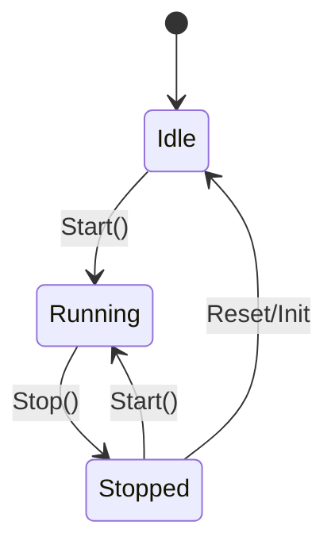
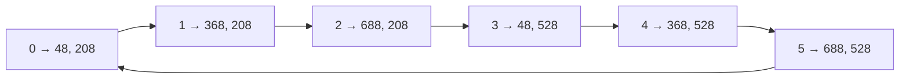
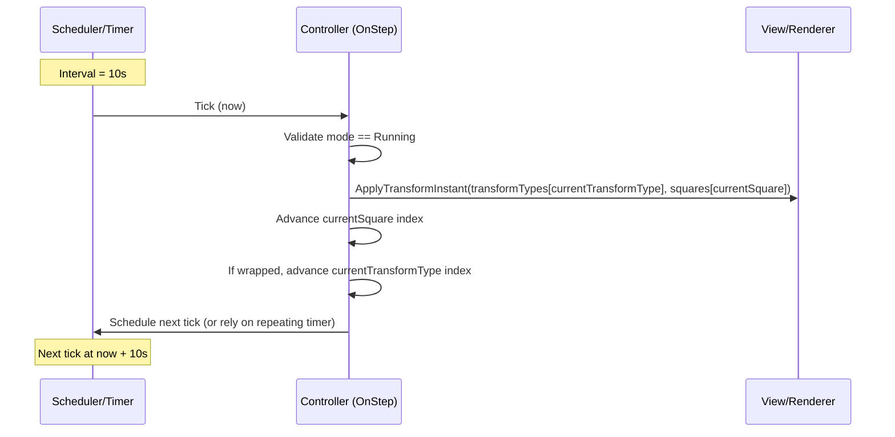

# Image Transformation Algorithm

## Overview

This document specifies a deterministic system that applies visual transformations to a 6‑square grid (3×2) rendered on
a 1024×1024 canvas. There is no live interpolation: a transformation is applied instantly to one square every 10
seconds. When the sequence wraps back to the first square, the transformation type switches (cycles) to the next one.

Goals:

- Provide a dedicated Algorithm section with step‑by‑step procedures.
- Define initialization, a discrete step handler, and state management.
- Document the transformation cycling flow.

## Grid Layout Specifications

### Canvas Properties

- Canvas size: 1024 × 1024 px
- Background: Image background
- Gap between squares: 32 px
- Square dimensions: 288 × 288 px
- Margins:
    - Left/Right: 48 px
    - Top/Bottom: 208 px

### Square Coordinates (x, y from top-left)

Using the provided sizes, the grid is exactly centered with the following coordinates:

- Column x positions: [48, 368, 688]
- Row y positions: [208, 528]

Squares (index → (x, y), left-to-right, top-to-bottom):

- 0 → (48, 208)
- 1 → (368, 208)
- 2 → (688, 208)
- 3 → (48, 528)
- 4 → (368, 528)
- 5 → (688, 528)

Indexing order is important for the sequential logic described below.

---

## Algorithm

### Data Structures

- squares: array[0..5] of RectangleRegion
    - RectangleRegion := { x: int, y: int, w: 288, h: 288 }
- transformTypes: array of TransformType, length ≥ 1
    - Example: [Rotate, Scale, Translate, Skew, OpacityFade]
- state: AnimationState
    - { mode: Mode, currentSquare: int, currentTransformType: int, stepDuration: TimeSpan, nextStepAt?: DateTimeOffset }
- scheduler
    - stepDuration = 10 s (per-square step)
    - Implementation: either a repeating 10 s timer that calls OnStep(), or a periodic wall‑clock check that triggers
      catch‑up steps if needed

Enums:

- Mode ∈ { Idle, Running, Stopped }
- TransformType ∈ user-defined types (see examples above)

### Initialization Algorithm

1. Build squares from constants:
    - xs = [48, 368, 688], ys = [208, 528]
    - squares = [(48,208), (368,208), (688,208), (48,528), (368,528), (688,528)]
2. Define transformTypes (order determines cycling).
3. Initialize state:
    - state.mode = Idle
    - state.currentSquare = 0
    - state.currentTransformType = 0
    - state.stepDuration = 10 s
    - Optionally: state.nextStepAt = now (immediate first step) or now + 10 s
4. Configure the scheduler (no per‑frame ticks):
    - Option A (simplest): DispatcherTimer Interval = 10 s; on Tick → OnStep(now)
    - Option B (robust): periodic check (e.g., every 1 s) that compares now to nextStepAt and performs catch‑up steps if
      multiple intervals elapsed.
5. Subscribe OnStep to the timer/scheduler.

### State Management Rules

- Idle: scheduler is configured but no steps are executed until Start().
- Running: OnStep is invoked by the scheduler once per 10 s (or via catch‑up logic).
- Stopped: reset to defaults; equivalent to freshly initialized Idle.

APIs (suggested):

- Start(): if state.mode ∈ {Idle, Stopped} → set mode = Running; optionally set nextStepAt = now.
- Stop(): set mode = Stopped; reset indices; clear nextStepAt if used.

### Step Handler (OnStep) Algorithm

Input: now (current time)
Minimal (no catch‑up):

1. If state.mode ≠ Running → return.
2. ApplyTransformInstant(transformTypes[state.currentTransformType], squares[state.currentSquare]).
3. state.currentSquare = (state.currentSquare + 1) mod 6.
4. If state.currentSquare == 0: state.currentTransformType = (state.currentTransformType + 1) mod transformTypes.Length.
5. Schedule the next step for now + stepDuration (or rely on a 10 s repeating timer).

Catch‑up variant (if using nextStepAt and a shorter periodic check):

1. If state.mode ≠ Running → return.
2. If now < nextStepAt → return.
3. steps = max(1, floor((now − nextStepAt) / stepDuration) + 1).
4. Repeat steps times:
    - ApplyTransformInstant(transformTypes[state.currentTransformType], squares[state.currentSquare]).
    - state.currentSquare = (state.currentSquare + 1) mod 6.
    - If state.currentSquare == 0: state.currentTransformType = (state.currentTransformType + 1) mod
      transformTypes.Length.
    - nextStepAt = (nextStepAt == default ? now : nextStepAt) + stepDuration.

### Transformation Cycling Flow

- Sequence of squares is fixed: 0 → 1 → 2 → 3 → 4 → 5 → (wrap)
- On each wrap to square 0, advance the transform type by one.
- Over time, pattern is:
    - (Square 0..5, TransformType A) → (Square 0..5, TransformType B) → (Square 0..5, TransformType C) → …
- Each square’s active transform lasts exactly 10 s before advancing.

### ApplyTransformInstant Contract (Per-Type Behavior)

- Rotate: apply the final angle (e.g., 360°) around the square’s center.
- Scale: set final scale (e.g., 1.2) around center; keep within canvas as needed.
- Translate: set final offset along the chosen path while remaining within bounds.
- Skew: set final skewX/skewY to configured limits.
- OpacityFade: set final opacity (e.g., αmin).

Implementation notes:

- Center of a square: (x + 144, y + 144).
- No interpolation frames are produced; the change is instantaneous at each 10 s step.
- Keep all transforms purely visual; do not mutate base square geometry.

### Pseudocode Summary

Initialization:

- BuildSquares()
- transformTypes = [...]
- state = { mode: Idle, currentSquare: 0, currentTransformType: 0, stepDuration: 10s, nextStepAt: now }
- scheduler: DispatcherTimer Interval = 10s; Tick → OnStep(now)

Start():

- if state.mode != Running: state.mode = Running

OnStep(now):

- if state.mode != Running: return
- ApplyTransformInstant(transformTypes[state.currentTransformType], squares[state.currentSquare])
- state.currentSquare = (state.currentSquare + 1) mod 6
- if state.currentSquare == 0:
    - state.currentTransformType = (state.currentTransformType + 1) mod transformTypes.Length

Stop():

- state = initial defaults; mode = Stopped

### Timing and Precision

- The per-square duration is fixed at 10 seconds between discrete steps.
- There are no intermediate frames; each step applies the final transform instantly.
- If the app is backgrounded, either rely on the repeating 10 s timer (may drift) or use nextStepAt to compute how many
  10 s intervals elapsed and perform catch‑up steps to realign with wall clock.

### Error Handling & Edge Cases

- transformTypes.Length must be ≥ 1; if empty, no-op safely in Running mode.
- If the app stalls or is throttled and multiple 10 s intervals pass, compute how many steps to perform and execute them
  sequentially (catch‑up variant) to keep logical time aligned.
- If you use a simple 10 s repeating timer and it drifts, the logical schedule will drift accordingly; prefer nextStepAt
  catch‑up if exact wall‑clock alignment matters.
- Window resize should not change logical square coordinates if rendering is done in a fixed 1024×1024 surface;
  otherwise derive coordinates proportionally from current canvas size.

### Test Checklist

- At t = 0 (if immediate start): transform applied to square 0 with transform type 0.
- At t = 10 s: transform applied to square 1 with the same transform type.
- At t = 60 s: sequence wraps to square 0 and transform type advances by 1.
- After N wraps: currentTransformType == (N mod transformTypes.Length).

## Mermaid Illustrations

Below are Mermaid diagrams that visualize the discrete, 10-second step system, the state machine, the traversal order of
squares, and the timing interactions.

### OnStep Flow (minimal, no catch-up)

```mermaid
flowchart TD
    A[Tick &bull; OnStep&#40;now&#41;] --> B{mode &#61;&#61; Running}
    B --&#124;No&#124;--> Z[Return]
    B --&#124;Yes&#124;--> C[ApplyTransformInstant&#40;transformTypes&#91;currentTransformType&#93;, squares&#91;currentSquare&#93;&#41;]
    C --> D[currentSquare &#61; &#40;currentSquare &#43; 1&#41; mod 6]
    D --> E{currentSquare &#61;&#61; 0}
    E --&#124;No&#124;--> F[Schedule next step at now &#43; stepDuration or rely on 10s timer]
    E --&#124;Yes&#124;--> G[currentTransformType &#61; &#40;currentTransformType &#43; 1&#41; mod transformTypes.Length]
    G --> F
```

### Mode State Machine

### Square Traversal Order (per 10 s step)

Note: The traversal order follows the sequence defined in the Algorithm section.

### Timing Sequence (every 10 seconds)

